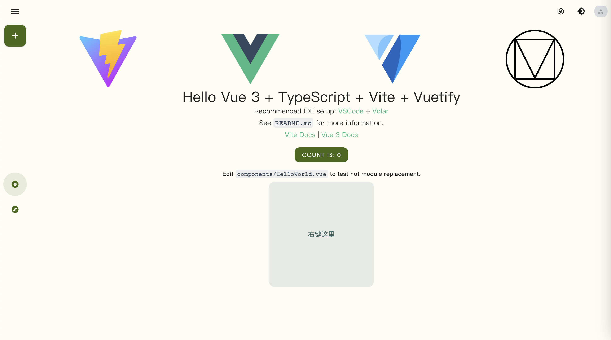

<p align="center">
  
</p>
<h1 align="center">
  vue material you template
</h1>
<p align="center">
    一个vite + vue3 + <a href="https://next.vuetifyjs.com/" target="_blank"> vuetifyjs</a> 微调为material you 主题的模版，开箱即用，<a href="https://m3.material.io/" target="_blank"> Material Design 3 (Material You)</a> 
</p>

## Introduction

- 基础的应用框架：导航，顶栏，侧边浮动页，设置页
- 集成右键菜单
- 自动生成 md3 主题色（浅色/暗色）

## 截图



## 运行

### 安装依赖

```
pnpm install

```

### 本地启动开发

```
npm run dev
```

### 打包

```
npm run build
```

## License

```
MIT License

Copyright (c) 2023 hyu

Permission is hereby granted, free of charge, to any person obtaining a copy
of this software and associated documentation files (the "Software"), to deal
in the Software without restriction, including without limitation the rights
to use, copy, modify, merge, publish, distribute, sublicense, and/or sell
copies of the Software, and to permit persons to whom the Software is
furnished to do so, subject to the following conditions:

The above copyright notice and this permission notice shall be included in all
copies or substantial portions of the Software.

THE SOFTWARE IS PROVIDED "AS IS", WITHOUT WARRANTY OF ANY KIND, EXPRESS OR
IMPLIED, INCLUDING BUT NOT LIMITED TO THE WARRANTIES OF MERCHANTABILITY,
FITNESS FOR A PARTICULAR PURPOSE AND NONINFRINGEMENT. IN NO EVENT SHALL THE
AUTHORS OR COPYRIGHT HOLDERS BE LIABLE FOR ANY CLAIM, DAMAGES OR OTHER
LIABILITY, WHETHER IN AN ACTION OF CONTRACT, TORT OR OTHERWISE, ARISING FROM,
OUT OF OR IN CONNECTION WITH THE SOFTWARE OR THE USE OR OTHER DEALINGS IN THE
SOFTWARE.


```
